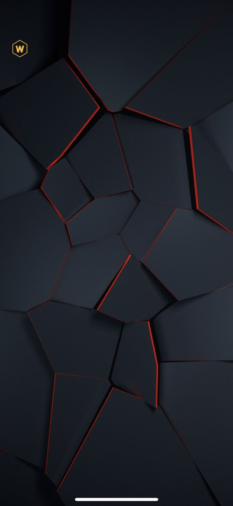
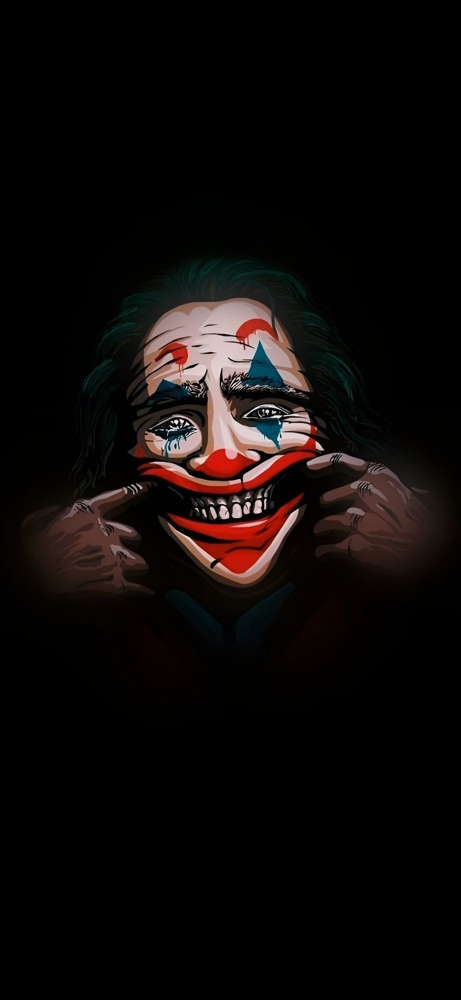

## index.html

```
<!DOCTYPE html>
<html lang="en">
<head>
    <meta charset="UTF-8">
    <meta name="viewport" content="width=device-width, initial-scale=1.0">
    <title>Interactive Photo Gallery</title>
    <link rel="stylesheet" href="gallery.css">
</head>
<body>
    <h1 class="heading">Interactive Image Gallery</h1>
    <div class="gallery">
        
        
        
        
        
        
    </div>
    <script src="script.js"></script>
</body>
</html>

```

## gallery.css

```
/* Basic reset for margin and padding */
body, html {
    margin: 0;
    padding: 0;
    font-family: Arial, sans-serif;
    background-color: #f0f0f0;
}

.heading{
    justify-content: center;
    align-items: center;
    display: flex;
    color: darkslategray;
}

.gallery {
    display: flex;
    justify-content: center;
    align-items: center;
    height: 100vh;
    background-color: #f0f0f0;
}

/* Styling for the gallery container */
.gallery {
    display: flex;
    flex-wrap: wrap;
    justify-content: center;
    gap: 20px;
}

/* Styling for each image */
.gallery img {
    width: 220px;
    height: 450px;
    border: 2px solid transparent;
    border-radius: 8px;
    box-shadow: 0 4px 6px rgba(0, 0, 0, 0.1);
    transition: transform 0.3s ease, box-shadow 0.3s ease;
    cursor: pointer;
}

/* Focused state styling */
.gallery img.focused {
    outline: none;
    border-color: #007bff;
    box-shadow: 0 4px 8px rgba(0, 0, 0, 0.2);
    transform: scale(1.05);
}

/* Adding focus outline for keyboard accessibility */
.gallery img:focus {
    outline: none;
    border-color: #007bff;
    box-shadow: 0 4px 8px rgba(0, 0, 0, 0.2);
    transform: scale(1.05);
}

/* Adding hover effect for mouse users */
.gallery img:hover {
    transform: scale(1.05);
    box-shadow: 0 4px 8px rgba(0, 0, 0, 0.2);
}

```

## script.js
```
document.addEventListener('DOMContentLoaded', (event) => {
    console.log('Page has loaded');

    const images = document.querySelectorAll('.gallery img');

    images.forEach((img, index) => {
        img.addEventListener('focus', onFocus);
        img.addEventListener('blur', onBlur);
        img.addEventListener('mousemove', onMouseMove);

        // Add tabindex to make the image focusable
        img.setAttribute('tabindex', '0');
    });

    function onFocus(event) {
        event.target.classList.add('focused');
        console.log(`Image ${event.target.alt} is focused`);
    }

    function onBlur(event) {
        event.target.classList.remove('focused');
        console.log(`Image ${event.target.alt} is blurred`);
    }

    function onMouseMove(event) {
        console.log(`Mouse is moving over image: ${event.target.alt}`);
    }
});

```

## OUTPUT :

